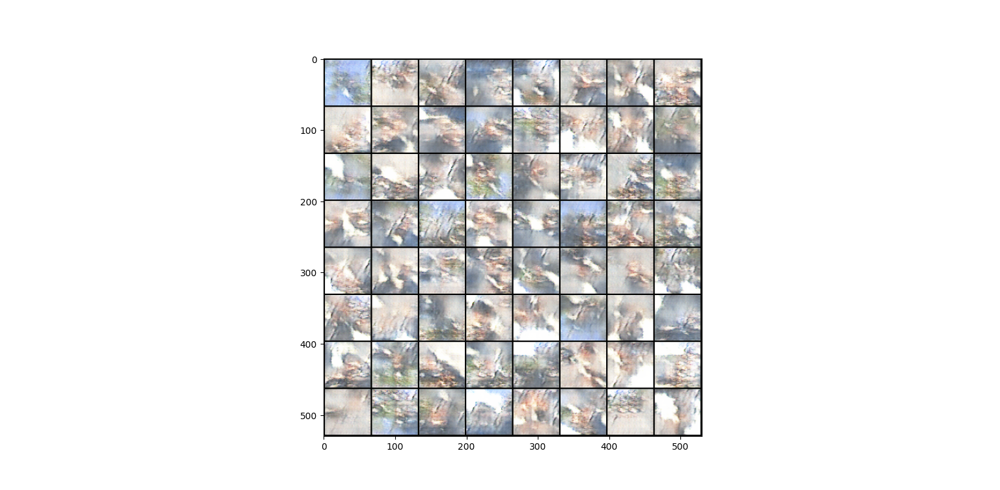

# GestureGAN

A project where I train a generative adversarial network, or GAN (more specifically, a deep convolutional generative adversarial network, or DCGAN) to generate images of certain hand gestures.

# Data Collection

A total of 1500 image samples were collected, according to the following format:

- 300 photos taken over 5 locations.
- In each location, 50 samples were allocated for each gesture, with 100 being control samples (no gesture).
- For the control samples, 25 had a face, 25 had a hand, 25 had neither, and 25 had both.
- For the gestures, 25 were recorded for each hand in various positions, with approximately half (12-13) of the 25 including faces, with the other half not including any face.
- the gestures recorded are: the middle finger, the ok sign, the thumbs up, and the peace sign (two fingers up)

A few sample images are shown below:

Photos were taken using an iPhone 13 Pro in the HEIC format, with 2316x3088 pixel resolution. When ported to a Windows PC, their resolution changed, with some images being 756x1008 and some being 579x772.

# Issues around the data collection

The largest issue is that a single person (myself) was used to take the photos; the model has learned to recognize gestures from people with my hand size, structure, and skin color. For example, if someone with darker skin and a larger hand than mine performed gestures, the model may struggle to recognize their gestures. I predict a more complex architecture than the one ultimately chosen would need to be used to effectivly capture these differences.

Another issue is the size of the dataset; there are only 1500 samples collected, and even after preprocessing (described in the next section), 12000 samples are available. This is far less than datasets used to train state-of-the-art models (such as ImageNet), which contain millions of samples.

Finally, the size of the images; the photos are far larger than popular image dataset sizes (MNIST, for instance, uses 28x28 photos [1]).

# Preprocessing

Preprocessing the data involves a few steps: we first convert the HEIC images to PNG. To ensure all images are the same size, we pad them to a size of 64x64, which also is intended to match the image size in the paper we reference.

# Generator and Discriminator Architecture

We will be using the generator and discriminator architectures from the paper "Unsupervised Representation Learning with Deep Convolutional Generative Adversarial Networks" [2].

# Optimizer and Loss

For both the generator and discriminator, we use binary cross entrpy (BCE) Loss. Both will also use the Adam optimizer.

# Best Practices Followed [3]

- using a DCGAN for image data.

- We train on real and fake image batches separately.

- generating latent vectors from a Gaussian rather than a uniform distribution

- using the tanh activation function on the generator's last layer

- flipping image labels when training generator (i.e. real = fake, fake = real)

- using LeakyRELU instead of RELU to avoid sparse gradients.

- one sided label smoothing for positive labels, reducing the vulnerability of the networks to competing examples. In our case, we use 0.9 as a positive label.

We intentionally use unlabeled data to observe what kind of gestures the generator will create if let to its own devices. Later, though, we will experiment with using labelled data (i.e. making an auxiliary GAN).

# Training

During training at each iteration, we train the discriminator and generator for one iteration (equivalent to setting k = 1, as described in [4]). 

# Evaluation

Once the generator is trained, we generate 64 latent vectors, and feed them into the generator to observe what kind of images it is generating.

# Some Runs

We start with a learning rate of 0.001, a batch_size of 100, 50 epochs, a beta1 value of 0.5, and a beta2 value of 0.999. This yields the following loss graphs:

And the following collection of generated images:

# References

[1] https://en.wikipedia.org/wiki/MNIST_database

[2] https://arxiv.org/abs/1511.06434

[3] https://github.com/soumith/ganhacks

[4] https://arxiv.org/abs/1406.2661