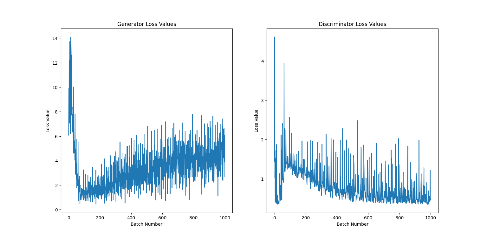

We train with a learning rate of 0.001, a batch_size of 100, 50 epochs, a beta1 value of 0.5, and a beta2 value of 0.999. This yields the following loss graphs:

And the following collection of generated images:

The generator is oscillating after some training; let's increase batch size and decrease learning rate. Since the learning adjustment is also far too large, let's decrease the beta1 and beta 2 values.

We train with a learning rate of 0.0002, a batch_size of 250, 50 epochs, a beta1 value of 0.3, and a beta2 value of 0.7. This yields the following loss graphs:

And the following collection of generated images:

Alright, let's incorporate a best practice; using SGD for the discriminator. In addition, it seems the learning rate is too low while the beta values are a bit too high. Let's increase learning rate, and decrease beta1 and beta2 values. In addition, the model needs to train for longer; let's increase the epochs.

We train with a learning rate of 0.0005, a batch_size of 250, 100 epochs, a beta1 value of 0.2, and a beta2 value of 0.5. This yields the following loss graphs:

And the following collection of generated images:

Okay, it seems the generator needs to be trained faster; let's increase just the beta1 and beta2 values.

We train with a learning rate of 0.0005, a batch_size of 250, 100 epochs, a beta1 value of 0.3, and a beta2 value of 0.6. This yields the following loss graphs:

And the following collection of generated images:

The generator is having a hard time learning; perhaps increasing the feature map size will help. We increase the feature mapping size of the generator to 128. In addition, the generator still needs to learn; let's increase the beta values more.

We train with a learning rate of 0.0005, a batch_size of 250, 100 epochs, a beta1 value of 0.5, and a beta2 value of 0.85. This yields the following loss graphs:

And the following collection of generated images:

It looks like using SGD isn't working; let's switch back to Adam for the discriminator.

We train with a learning rate of 0.0005, a batch_size of 250, 100 epochs, a beta1 value of 0.5, and a beta2 value of 0.85. This yields the following loss graphs:

And the following collection of generated images:

Perhaps the generator needs to train a bit faster than the discriminator?

We train with a learning rate of 0.0005 for the discriminator, 0.001 for the generator, a batch_size of 250, 100 epochs, a beta1 value of 0.5, and a beta2 value of 0.85. This yields the following loss graphs:

And the following collection of generated images:

Alright, beta1 and beta2 values were too high; let's decrease them.

We train with a learning rate of 0.0005 for the discriminator, 0.001 for the generator, a batch_size of 250, 100 epochs, a beta1 value of 0.4, and a beta2 value of 0.7. This yields the following loss graphs:

And the following collection of generated images:

Learning rate also seems to be too high; let's decrease that, and also decrease beta1 and beta2.

We train with a learning rate of 0.0001 for the discriminator, 0.0002 for the generator, a batch_size of 250, 100 epochs, a beta1 value of 0.35, and a beta2 value of 0.65. This yields the following loss graphs:

And the following collection of generated images:

Alright, after some research, it's time to implement some changes; first, we will add some noise to the inputs for both real and generated images for the discriminator. Second, we will use more label smoothing (i.e. real labels will be 1.0 plus samples from a standard normal, fake labels will be 0.0 plus labels from a standard normal). Each noise tensor applied to the labels will be multiplied by 0.1 to ensure the deviation isn't too strong. Third, we will incorporate dropout into the layers of the discriminator (one dropout layer with p = 0.2 after each batch normalization).

We will see if these actually lead to improved learning.

We train with a learning rate of 0.001 for the discriminator, 0.002 for the generator, a batch_size of 250, 100 epochs, a beta1 value of 0.4, and a beta2 value of 0.7. This yields the following loss graphs:

And the following collection of generated images:

That evidently didn't work; let's remove the noise and see if that is what's causing the issue? We also decrease the normal distribution multiplier to 0.05 to have less chaotic smoothing.

We train with a learning rate of 0.001 for the discriminator, 0.002 for the generator, a batch_size of 250, 100 epochs, a beta1 value of 0.4, and a beta2 value of 0.7. This yields the following loss graphs:

And the following collection of generated images:

Back to somewhat coherent images (even though no gestures are forming, structure from the training data is coming through). Let's try training them for longer and see what kind of images are produced.

We train with a learning rate of 0.001 for the discriminator, 0.002 for the generator, a batch_size of 250, 200 epochs, a beta1 value of 0.4, and a beta2 value of 0.7. This yields the following loss graphs:

And the following collection of generated images:

Training for longer seems to work; let's increase the epochs.

We train with a learning rate of 0.001 for the discriminator, 0.002 for the generator, a batch_size of 250, 500 epochs, a beta1 value of 0.4, and a beta2 value of 0.7. This yields the following loss graphs:

And the following collection of generated images:

Alright, let's try training for even longer.

We train with a learning rate of 0.001 for the discriminator, 0.002 for the generator, a batch_size of 250, 1500 epochs, a beta1 value of 0.4, and a beta2 value of 0.7. This yields the following loss graphs:

And the following collection of generated images:

Alright, this is a decent place to stop. Now, what are some possible reasons for the model producing images like this?

- the discriminator is clearly outpacing the generator, which could be factoring into how the generator replicates the data distribution.

- the variance in the data is high due to the variety of samples in the data in terms of gestures and scenes, causing the generator to have a harder time replicating the data distribution.

- relating to the above point, the generator's architecture is too simple to capture the data distribution (this is unlikely, as the same architecture was used to generate varying faces that were coherent).

- training GANs in general is a difficult endeavor.

Though, all things considered, this model turned out not too bad. 